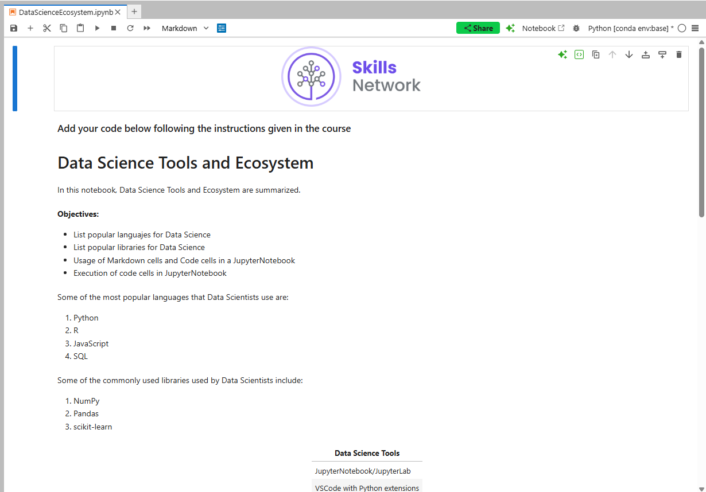
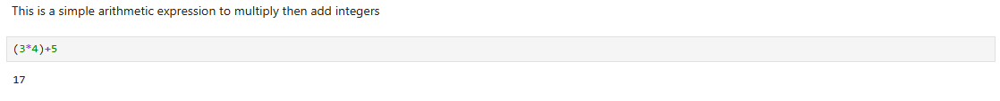
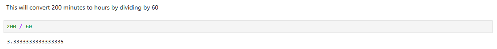

# IBM Data Science Professional Certificate | Tools for Data Science - Final Assignment
The final assignment evaluated my knowledge regarding the usage of JupyterNotebooks. Here are the results:

